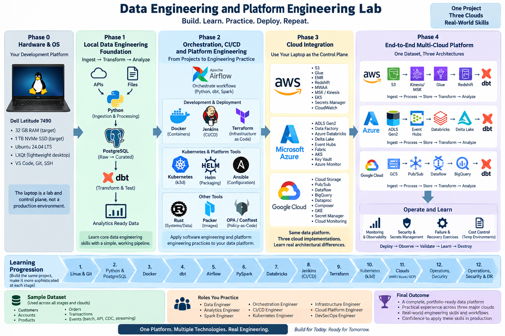
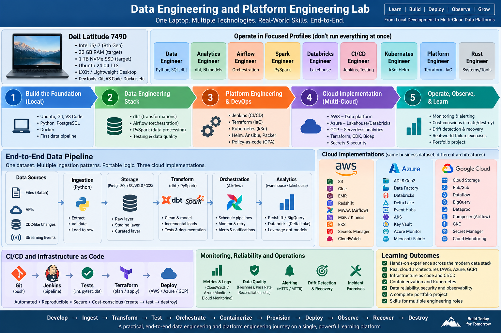

# DE_Portfolio

## Full Project Goals


## Data Engineering and Platform Engineering Laboratory Plan



## Portfolio Overview

The goal of this project is to build a practical **Data Engineering and Platform Engineering laboratory** that evolves in stages rather than as a collection of unrelated tutorials.

The Dell Latitude 7490 serves as the local development workstation and control plane. The environment is designed around workload profiles so that only the technologies currently being studied need to run at the same time.

### Target Hardware

| Component        | Target                              |
| ---------------- | ----------------------------------- |
| Laptop           | Dell Latitude 7490                  |
| Memory           | 32 GB RAM                           |
| Storage          | 1 TB NVMe SSD                       |
| Operating System | Ubuntu Linux                        |
| Desktop          | LXQt or another lightweight desktop |

### Core Technology Stack

* Linux
* Git
* Python
* Rust
* PostgreSQL
* Docker
* Docker Compose
* dbt
* Apache Airflow
* PySpark
* Databricks
* Jenkins
* Terraform
* Kubernetes
* k3d
* Helm
* Ansible
* Packer
* OPA / Conftest
* VS Code

> **Guiding Principle:**
> Build one data platform repeatedly, making it more sophisticated at each stage instead of completing a series of disconnected tutorials.

---

# Phase 1 — Local Data Engineering Foundation

Begin with the core technologies required to build and operate a basic data pipeline:

```text
Linux
  ↓
Git
  ↓
Python
  ↓
PostgreSQL
```

PostgreSQL runs inside Docker rather than being permanently installed as a host service.

Python performs ingestion and transformation while PostgreSQL initially serves as both the operational data source and analytical warehouse.

## Initial Pipeline

```text
API / Files
    ↓
  Python
    ↓
PostgreSQL RAW
    ↓
Transformation
    ↓
Curated Data
    ↓
Data Quality Tests
```

This establishes the fundamental Data Engineering workflow:

* Data ingestion
* SQL
* Transformation
* Testing
* Logging
* Repeatable execution
* Data quality validation

---

## Add dbt

Next, introduce **dbt** and organize PostgreSQL into warehouse-style layers:

```text
RAW
 ↓
STAGING
 ↓
INTERMEDIATE
 ↓
MARTS
```

Practice:

* Dimensional modeling
* Incremental models
* Snapshots
* Jinja
* Macros
* dbt tests
* Documentation
* Lineage
* Source freshness

---

## Add Airflow

Once individual pipeline components work correctly, introduce **Apache Airflow** as the orchestration layer.

Airflow coordinates:

```text
Python Ingestion
      ↓
Transformation
      ↓
     dbt
      ↓
Data Quality Validation
```

---

## Add PySpark

Introduce **PySpark** after the core pipeline is stable.

Initially use local Spark execution rather than attempting to simulate a large distributed Spark cluster.

Focus on:

* DataFrames
* Transformations
* Actions
* Joins
* Window functions
* Partitioning
* Shuffle behavior
* Predicate pushdown
* Partition pruning
* Parquet
* Spark SQL
* Explain plans

---

## Phase 1 Learning Progression

```text
Linux / Git
    ↓
Python / PostgreSQL
    ↓
Docker
    ↓
dbt
    ↓
Airflow
    ↓
PySpark
    ↓
Databricks
```

The same project evolves at every stage.

---

# Phase 2 — Software Engineering and Platform Engineering

Once the data pipeline works, begin treating it as a production software project.

## CI/CD with Jenkins

Introduce Jenkins as the CI/CD engine.

A Git commit should trigger tasks such as:

```text
Git Commit
    ↓
 Jenkins
    ↓
Python Lint
    ↓
  pytest
    ↓
dbt Compile
    ↓
 dbt Test
    ↓
Rust Tests
    ↓
Docker Build
```

The objective is to automate validation before deployment.

---

## Infrastructure as Code with Terraform

Terraform becomes a first-class engineering discipline rather than merely a cloud deployment tool.

Learn:

* Providers
* Resources
* Variables
* Outputs
* Modules
* State
* Remote state
* State locking
* Imports
* Drift detection
* Lifecycle management

Start locally before moving into cloud environments.

A useful progression is:

```text
Docker Compose
      ↓
Terraform Docker Provider
      ↓
Kubernetes YAML
      ↓
Helm
```

---

## Kubernetes

Introduce Kubernetes locally using **k3d**.

Start with native Kubernetes objects before adding higher-level abstractions.

Learn:

* Pods
* Deployments
* Services
* ConfigMaps
* Secrets
* Jobs
* CronJobs
* Persistent Volumes
* Persistent Volume Claims
* Namespaces
* Resource requests
* Resource limits
* Health checks
* Ingress

---

## Helm

Once Kubernetes fundamentals are understood, package applications with Helm.

```text
Raw Kubernetes YAML
        ↓
      Helm
        ↓
Reusable Kubernetes Deployment
```

---

## Platform Tool Responsibilities

Each platform technology should have a clearly defined responsibility.

| Tool           | Responsibility                             |
| -------------- | ------------------------------------------ |
| Terraform      | Create infrastructure                      |
| Ansible        | Configure hosts                            |
| Helm           | Package and deploy Kubernetes applications |
| Jenkins        | Control CI/CD lifecycle                    |
| Packer         | Create immutable machine images            |
| OPA / Conftest | Policy-as-Code enforcement                 |

This separation reflects a production Platform Engineering model rather than treating IaC as a collection of deployment scripts.

---

# Phase 3 — Move From Local POC to Cloud

Once the local environment reaches proof-of-concept maturity, the laptop becomes the **development workstation and control plane**.

The portable engineering core remains local:

```text
Git
Python
Rust
Docker
dbt
PySpark
Airflow
Jenkins
Kubernetes
Terraform
```

Cloud CLIs, SDKs, APIs, and Terraform providers connect the local environment to cloud-managed infrastructure.

The progression becomes:

```text
Local
  ↓
Containerized
  ↓
Kubernetes
  ↓
Cloud-Native
  ↓
Multi-Cloud
```

---

# AWS Data Engineering Track

AWS becomes the broad cloud Data Engineering implementation.

### Target Services

| Function       | AWS Service     |
| -------------- | --------------- |
| Object Storage | S3              |
| ETL            | Glue            |
| Spark          | Glue / EMR      |
| Data Warehouse | Redshift        |
| Orchestration  | MWAA            |
| Streaming      | MSK / Kinesis   |
| Containers     | EKS             |
| Secrets        | Secrets Manager |
| Monitoring     | CloudWatch      |
| Infrastructure | Terraform       |

Example architecture:

```text
API / Files / Events
        ↓
       S3
        ↓
      Glue
        ↓
    Redshift
        ↓
       dbt
        ↓
Analytics Mart
```

---

# Azure Data Engineering Track

Azure becomes the primary **Databricks and Lakehouse implementation**.

### Target Services

| Function       | Azure Service      |
| -------------- | ------------------ |
| Object Storage | ADLS Gen2          |
| Ingestion      | Data Factory       |
| Lakehouse      | Azure Databricks   |
| Processing     | Spark / Databricks |
| Table Format   | Delta Lake         |
| Governance     | Unity Catalog      |
| Streaming      | Event Hubs         |
| Analytics      | Microsoft Fabric   |
| Containers     | AKS                |
| Secrets        | Key Vault          |
| Monitoring     | Azure Monitor      |
| Infrastructure | Terraform          |

Example architecture:

```text
API / Files / Events
        ↓
Azure Data Factory
        ↓
    ADLS Gen2
        ↓
Azure Databricks
        ↓
     Spark
        ↓
   Delta Lake
        ↓
 Unity Catalog
        ↓
   dbt / Fabric
```

---

# GCP Data Engineering Track

GCP becomes the serverless analytics implementation.

### Target Services

| Function          | GCP Service      |
| ----------------- | ---------------- |
| Object Storage    | Cloud Storage    |
| Warehouse         | BigQuery         |
| Batch / Streaming | Dataflow         |
| Spark             | Dataproc         |
| Streaming         | Pub/Sub          |
| Orchestration     | Cloud Composer   |
| Containers        | GKE              |
| Secrets           | Secret Manager   |
| Monitoring        | Cloud Monitoring |
| Infrastructure    | Terraform        |

Example architecture:

```text
Events
  ↓
Pub/Sub
  ↓
Dataflow
  ↓
BigQuery
  ↓
 dbt
  ↓
Analytics Models
```

---

# Phase 4 — One Dataset, Three Cloud Architectures

Avoid artificial `Hello World` projects.

Create one synthetic business dataset containing:

* Customers
* Accounts
* Products
* Orders
* Transactions
* Events

Generate multiple ingestion patterns:

* Batch files
* APIs
* CDC-like events
* Streaming events

Then implement the same business requirements independently in each cloud.

## AWS

```text
Events / Files
      ↓
Kinesis / MSK / S3
      ↓
     Glue
      ↓
   Redshift
      ↓
     dbt
```

## Azure

```text
Events / Files
      ↓
Event Hubs / ADLS
      ↓
  Databricks
      ↓
 Delta Lake
      ↓
     dbt
```

## GCP

```text
Events / Files
      ↓
 Pub/Sub / GCS
      ↓
   Dataflow
      ↓
   BigQuery
      ↓
     dbt
```

The objective is to demonstrate both:

* **Portable Data Engineering principles**
* **Legitimate cloud architectural differences**

Portable components should include:

```text
Python
SQL
dbt
PySpark
pytest
Rust
Docker
Git
Terraform
```

Cloud-specific storage, messaging, security, monitoring, and infrastructure implementations remain provider-specific.

---

# Phase 5 — Operational Engineering

The final phase moves beyond simply making pipelines work.

## CI/CD Deployment Lifecycle

Jenkins becomes the deployment controller.

```text
Git
 ↓
Tests
 ↓
Terraform Plan
 ↓
Approval
 ↓
Terraform Apply
 ↓
AWS / Azure / GCP
 ↓
Validation
```

---

## Cost-Controlled Cloud Environments

Cloud environments should be temporary whenever practical.

```bash
terraform apply
```

Run the experiment.

Collect results.

Then:

```bash
terraform destroy
```

This teaches infrastructure lifecycle management while controlling cloud costs.

---

## Drift and Failure Exercises

The lab should deliberately introduce failures.

Examples:

1. Terraform creates infrastructure.
2. Manually modify the resource in the cloud console.
3. Run:

```bash
terraform plan
```

4. Detect the configuration drift.
5. Decide whether Terraform should restore the desired state or the IaC definition should change.

Repeat this exercise with:

* IAM policies
* Security groups
* Storage lifecycle rules
* Kubernetes configurations
* Networking
* Database settings

Also practice:

* Remote Terraform state
* State locking
* Infrastructure recovery
* Disaster recovery
* Secrets management
* Configuration rollback

---

# Observability and Data Reliability

Implement a common logical observability model across all three cloud platforms.

## Core Metrics

Track:

* Freshness SLA
* Quality Pass Rate
* Reconciliation Variance
* Rejected Records
* Pipeline Duration
* Data Volume
* Mean Time to Detect (MTTD)
* Mean Time to Recover (MTTR)
* Incident Frequency
* Repeat Incidents

Each cloud uses its native telemetry platform:

| Cloud | Monitoring       |
| ----- | ---------------- |
| AWS   | CloudWatch       |
| Azure | Azure Monitor    |
| GCP   | Cloud Monitoring |

The monitoring implementation changes, but the **logical reliability model remains consistent**.

---

# Engineering Roles Practiced

The completed lab provides practical exposure to several engineering disciplines.

| Role                    | Primary Technologies                     |
| ----------------------- | ---------------------------------------- |
| Data Engineer           | Python, PostgreSQL, PySpark, dbt         |
| Analytics Engineer      | SQL, dbt, PostgreSQL                     |
| Spark Engineer          | PySpark, Databricks, EMR, Dataproc       |
| Orchestration Engineer  | Airflow, MWAA, Composer                  |
| CI/CD Engineer          | Jenkins, Git, Docker                     |
| Kubernetes Engineer     | Kubernetes, k3d, kubectl, Helm           |
| Infrastructure Engineer | Terraform, Ansible, Packer               |
| AWS Platform Engineer   | Terraform, AWS CLI, CDK / CloudFormation |
| Azure Platform Engineer | Terraform, Azure CLI, Bicep              |
| GCP Platform Engineer   | Terraform, gcloud                        |
| DevSecOps Engineer      | OPA, Conftest, Secrets Management        |
| Platform Engineer       | IaC, CI/CD, Kubernetes, Observability    |

---

# Full Learning Progression

```text
Linux / Git
    ↓
Python / PostgreSQL
    ↓
Docker / Docker Compose
    ↓
dbt
    ↓
Airflow
    ↓
PySpark
    ↓
Databricks
    ↓
Jenkins
    ↓
Terraform
    ↓
Kubernetes / k3d
    ↓
Helm
    ↓
AWS
    ↓
Azure
    ↓
GCP
    ↓
Terraform State / Locking
    ↓
Ansible
    ↓
AWS CDK / Azure Bicep
    ↓
Packer
    ↓
Policy-as-Code
    ↓
Multi-Cloud CI/CD
    ↓
Drift / Disaster Recovery
```

---

# End-to-End Engineering Lifecycle

The project demonstrates the complete engineering lifecycle:

```text
Develop
   ↓
Ingest
   ↓
Transform
   ↓
Test
   ↓
Orchestrate
   ↓
Containerize
   ↓
Provision
   ↓
Deploy
   ↓
Observe
   ↓
Recover
   ↓
Destroy
```

---

# Final Outcome

The finished environment is more than a collection of installed tools.

It becomes both:

1. A structured **Data Engineering learning curriculum**
2. A demonstrable **multi-cloud Data Engineering reference platform**

The project shows how:

* Application development
* Data engineering
* Analytics engineering
* DevOps
* Platform engineering
* Infrastructure as Code
* Kubernetes
* Cloud architecture
* Security
* Observability
* Data reliability
* Disaster recovery

fit together as a single engineering system.

> **One project. One evolving platform. Multiple technologies. Real engineering.**

TODO A useful next improvement would be adding a **repository structure, architecture diagram link, prerequisites, setup commands, and progress checklist** so the README can serve as both project documentation and your actual learning roadmap.
