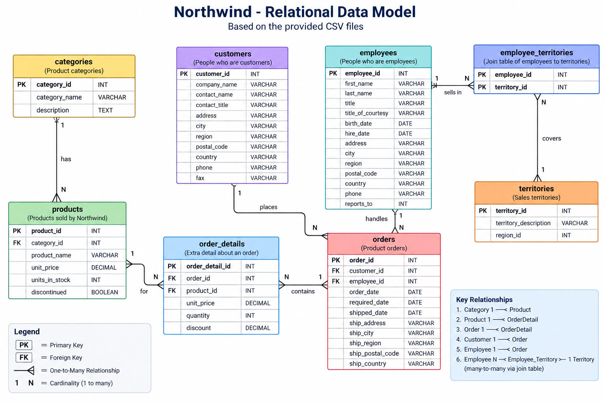

## Northwind Relational Data Model


### Overview

The Northwind relational data model represents a simplified sales and order-processing environment. It organizes information about **customers, employees, products, product categories, orders, order details, and sales territories** into related tables.

The model demonstrates several fundamental relational database concepts:

- Primary and foreign keys
- One-to-many relationships
- Many-to-many relationships
- Associative or join tables
- Transaction header/detail modeling
- Referential integrity
- Separation of business entities into normalized tables

The primary business flow represented by the model is:

```text
Customer
   │
   └── places ──> Order
                    │
Employee ─ handles ─┤
                    │
                    └── contains ──> Order Detail ──> Product ──> Category

Employee
   │
   └── assigned through Employee Territories ──> Territory
```

---

## Core Entities

### Categories

The `categories` table contains the classifications used to organize products.

```text
categories
├── category_id        PK
├── category_name
└── description
```

Each category can contain multiple products, while each product belongs to a single category.

**Relationship:**

```text
Category 1 ─────< N Product
```

Examples might include categories such as beverages, seafood, produce, or dairy products.

---

### Products

The `products` table represents the products available for sale.

```text
products
├── product_id         PK
├── category_id        FK
├── product_name
├── unit_price
├── units_in_stock
└── discontinued
```

The `category_id` foreign key connects each product to its corresponding category.

Products also participate in orders through the `order_details` table. A product can appear on many different orders.

Therefore, products have two important relationships:

```text
Category 1 ─────< N Product

Product 1 ─────< N OrderDetail
```

---

### Customers

The `customers` table represents people or organizations purchasing products.

Conceptually, when the same data is represented in a graph model, these records could become:

```text
(:Person:Customer)
```

The relational representation contains customer attributes such as:

```text
customers
├── customer_id        PK
├── company_name
├── contact_name
├── contact_title
├── address
├── city
├── region
├── postal_code
├── country
├── phone
└── fax
```

A customer can place multiple orders, but an individual order belongs to one customer.

**Relationship:**

```text
Customer 1 ─────< N Order
```

The `customer_id` stored in `orders` provides the foreign-key relationship.

---

### Employees

The `employees` table represents employees responsible for processing or managing customer orders.

In a graph representation, an employee could be represented as:

```text
(:Person:Employee)
```

The relational table contains employee information such as:

```text
employees
├── employee_id        PK
├── first_name
├── last_name
├── title
├── title_of_courtesy
├── birth_date
├── hire_date
├── address
├── city
├── region
├── postal_code
├── country
├── phone
└── reports_to
```

An employee can handle multiple orders.

```text
Employee 1 ─────< N Order
```

The relationship is implemented through the `employee_id` foreign key in the `orders` table.

The `reports_to` attribute can additionally represent an employee hierarchy by referencing another employee.

Conceptually:

```text
Employee
    │
    └── reports to ──> Employee
```

This is known as a **self-referencing relationship**.

---

## Orders and Order Details

The order portion of the model uses a common **header/detail pattern**.

### Orders

The `orders` table represents the overall business transaction.

```text
orders
├── order_id           PK
├── customer_id        FK
├── employee_id        FK
├── order_date
├── required_date
├── shipped_date
├── ship_address
├── ship_city
├── ship_region
├── ship_postal_code
└── ship_country
```

An order identifies both the customer placing the order and the employee responsible for it.

The major relationships are therefore:

```text
Customer 1 ─────< N Order

Employee 1 ─────< N Order
```

An order can contain multiple products. Rather than storing product information directly in the order record, those individual line items are stored in `order_details`.

---

### Order Details

The `order_details` table represents the individual line items belonging to an order.

```text
order_details
├── order_detail_id    PK
├── order_id           FK
├── product_id         FK
├── unit_price
├── quantity
└── discount
```

Each order can contain multiple order-detail records:

```text
Order 1 ─────< N OrderDetail
```

Each product can also appear in multiple order-detail records:

```text
Product 1 ─────< N OrderDetail
```

This makes `order_details` an important transactional entity because it resolves the logical **many-to-many relationship between orders and products**.

Conceptually:

```text
                 OrderDetail
                /           \
               /             \
              N               N
             /                 \
            1                   1
         Order               Product
```

From the business perspective:

```text
Order N >─────< N Product
```

But relationally this is implemented as:

```text
Order 1 ─────< N OrderDetail N >───── 1 Product
```

This design also allows attributes specific to the transaction—such as `quantity`, `unit_price`, and `discount`—to be stored with the relationship between the order and product.

For example, the product's current price might be `$25.00`, while the `order_details.unit_price` records that it was sold for `$22.50` on a particular order.

---

## Territories

The `territories` table defines geographical sales territories.

```text
territories
├── territory_id           PK
├── territory_description
└── region_id
```

Employees can be responsible for multiple territories, and a territory can potentially have multiple employees associated with it.

This creates a many-to-many relationship:

```text
Employee N >─────< N Territory
```

A relational database normally resolves this relationship using a join table.

---

## Employee Territories

The `employee_territories` table is an **associative or join table** connecting employees with their assigned territories.

```text
employee_territories
├── employee_id        PK, FK
└── territory_id       PK, FK
```

Together, the two columns form a composite key identifying a unique employee/territory assignment.

The relationships become:

```text
Employee
    1
    │
    │
    N
Employee_Territories
    N
    │
    │
    1
Territory
```

This implements the logical relationship:

```text
Employee N >─────< N Territory
```

In a graph database, the join table may no longer be necessary because the relationship itself can be represented directly:

```text
(:Employee)-[:SELLS_IN]->(:Territory)
```

This illustrates an important difference between relational and graph modeling. The relational model requires an intermediary table to resolve the many-to-many relationship, while a graph database can represent the connection as a first-class relationship.

---

## Relationship Summary

| Parent Entity | Relationship | Child Entity | Cardinality |
|---|---|---|---|
| Category | contains | Product | 1:N |
| Customer | places | Order | 1:N |
| Employee | handles | Order | 1:N |
| Order | contains | OrderDetail | 1:N |
| Product | appears in | OrderDetail | 1:N |
| Employee | assigned to | EmployeeTerritory | 1:N |
| Territory | assigned through | EmployeeTerritory | 1:N |
| Employee | sells in | Territory | N:M |
| Employee | reports to | Employee | Self-referencing |

---

## End-to-End Business Relationship

Taken together, the model describes the primary Northwind sales process:

```text
Category
   │
   └──< Product
            │
            └──< OrderDetail >── Order
                                  │    │
                                  │    └── Customer
                                  │
                                  └── Employee
                                         │
                                         └──< EmployeeTerritory >── Territory
```

A **customer places an order**, an **employee handles the order**, and the order contains one or more **order details**. Each order detail identifies a **product**, and every product belongs to a **category**.

Separately, employees are associated with the **sales territories** in which they operate through the `employee_territories` join table.

The result is a normalized relational model that separates major business entities while connecting them through primary-key and foreign-key relationships. It provides a useful foundation for demonstrating relational SQL concepts and for subsequently showing how the same business domain can be transformed into a graph model using nodes such as `Customer`, `Employee`, `Product`, and `Territory` and explicit relationships such as `PLACES`, `HANDLES`, `CONTAINS`, and `SELLS_IN`.
````
